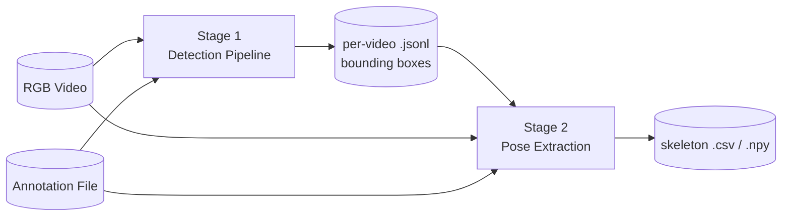
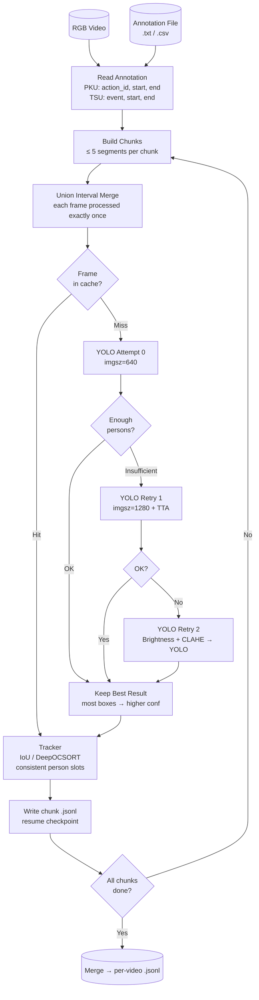
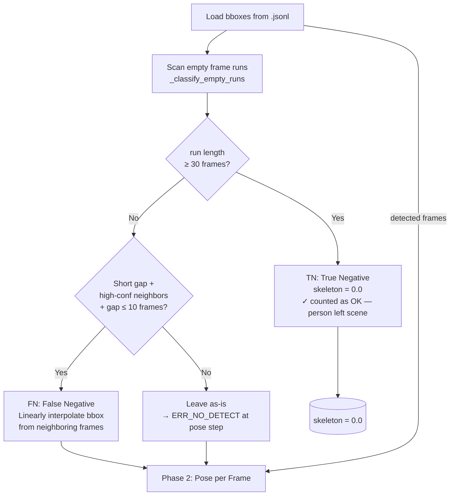
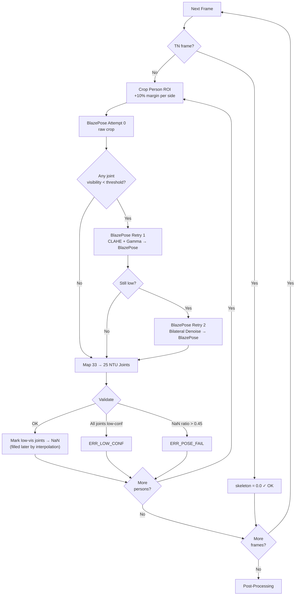
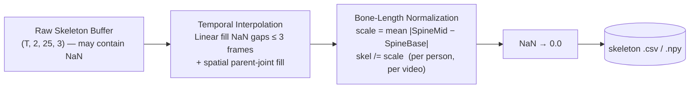

# PROJECT_DESCRIPTION — Skeleton-EAA-Pose

## 1. Purpose & Motivation

`Skeleton-EAA-Pose` extracts 3D skeleton sequences from standard **RGB video** and converts them into the **25-joint NTU-format** used by the downstream CTSK-Former action recognition model.

### Problem Statement

Benchmark action recognition datasets such as **PKU-MMD** (Liu et al., 2017) and **TSU** were originally captured using **Microsoft Kinect** sensor rigs that provide synchronized RGB and depth streams. Their ground-truth skeleton annotations are reconstructed from depth data, yielding high-quality 3D joint positions in metric space.

In real-world deployment, depth sensors are often unavailable, cost-prohibitive, or impractical (outdoor, mobile, single-camera setups). This pipeline addresses the question: **can a model trained on depth-derived skeleton annotations generalize to skeletons extracted from plain RGB video?**

To answer this, we need a pipeline that:
1. Produces skeleton sequences in the same 25-joint NTU format as the ground-truth labels
2. Handles the inherent noise from monocular depth estimation (Z-axis from RGB)
3. Maximizes coverage — extracting a valid skeleton for as many annotated frames as possible

### Key Insight

After Procrustes alignment (SVD-based rotation/scale/translation removal), PA-MPJPE reduces from ~1.58m to ~0.58m — a **63% reduction**. This confirms that the RGB-extracted skeletons recover the correct *structural shape* of the skeleton; the dominant error is a **systematic coordinate system offset** between Kinect depth space and MediaPipe world space, not random structural failure. This motivates using RGB-extracted skeletons as noisy-but-structurally-valid training data for the downstream model.

---

## 2. Design Decisions

| Decision | Choice | Rationale |
|----------|--------|-----------|
| **Person detector** | YOLOv8 (Ultralytics) | State-of-the-art speed/accuracy tradeoff; native multi-person NMS; widely supported |
| **Pose estimator** | MediaPipe BlazePose Heavy | Provides both 2D image landmarks and 3D world landmarks from a single RGB image; world landmarks are camera-distance invariant |
| **Joint format** | NTU 25-joint | Directly compatible with PKU-MMD / NTU-RGB+D ground-truth; allows fair metric comparison |
| **Coordinate mode** | World landmarks (meters) | Camera-independent; `output.coordinate_mode: world` uses MediaPipe's internal 3D coordinate system relative to mid-hip |
| **Two-stage architecture** | Separate detection & pose | Allows detection to be run once at scale (multi-worker), pose extraction to be debugged independently |
| **Temporal TN/FN split** | `empty_run_frames = 30` threshold | A gap of <1 second is likely a missed detection (FN); longer gaps indicate the person genuinely left the scene (TN) |
| **Bone-length normalization** | Scale by mean `|SpineMid − SpineBase|` | Makes skeletons scale-invariant across subjects and camera distances; consistent with common skeleton preprocessing in action recognition |

---

## 3. Two-Stage Architecture

Decoupling the stages allows independent inspection of detection quality, chunk-level resume on crash, and parallel multi-worker detection across videos.

---

## 4. Stage 1 — Person Detection

### 4.1 Full Detection Flow

### 4.2 Key Behaviors

- **Interactive actions** (PKU IDs: 12, 14, 16, 18, 21, 24, 26, 27) → `n_expected = 2` persons; DeepOCSORT tracker used for consistent slot assignment across frames
- **Single-person actions** → `n_expected = 1`; top-confidence bounding box only
- **Frame cache** persists across all chunks of a video; overlap frames between adjacent chunks are never re-detected
- **Resume**: if a chunk's temp `.jsonl` already exists on disk, that chunk is skipped entirely and its data is loaded into the cache to continue from the next chunk
- **Fail visualization**: chunks with high failure rates write a diagnostic video + per-frame JPEGs to `failed_frames/`

---

## 5. Stage 2 — Pose Extraction

### 5.1 Phase 1 — Temporal Classification of Empty Frames

### 5.2 Phase 2 — Per-Frame Pose Estimation

### 5.3 Post-Processing

---

## 6. Temporal Classification Summary

| Scenario | Label | Skeleton value | Counted as |
|----------|-------|---------------|-----------|
| Person detected, all joints valid | — | 3D world coords | ✓ ok |
| Person detected, some joints low-conf | — | NaN on bad joints | ✓ ok (filled by interp) |
| Person detected, too many NaN (>45%) | ERR_POSE_FAIL | NaN → 0 | ✗ fail |
| Short empty gap, high-conf neighbors exist | **FN** | BBox interpolated → run pose | ✓ or ✗ |
| Long empty run (≥ 30 consecutive frames) | **TN** | 0.0 (intentional zero) | ✓ ok |
| Short gap, no usable neighbors | ERR_NO_DETECT | NaN → 0 | ✗ fail |

---

## 7. Retry & Fallback Summary

### Detection Retries (Stage 1)

| Attempt | Strategy | Purpose |
|---------|---------|---------|
| 0 | YOLO at `imgsz=640` | Standard baseline inference |
| 1 | YOLO at `imgsz=1280` + TTA | Improve recall on small/distant persons |
| 2 | Brightness boost + CLAHE → YOLO at `imgsz=640` | Handle low-light / low-contrast frames |

Best result across attempts is kept (prioritized by: more valid boxes → higher average confidence).

### Pose Retries (Stage 2)

| Attempt | Strategy | Purpose |
|---------|---------|---------|
| 0 | BlazePose on raw crop | Baseline |
| 1 | CLAHE + Gamma correction → BlazePose | Improve contrast for occluded/dark joints |
| 2 | Bilateral denoise → BlazePose | Remove noise artifacts before pose estimation |

### Tracker Fallback

| Config value | Behavior |
|---|---|
| `iou` (default) | IoU matching with previous frame; left-to-right slot assignment on first frame |
| `deepocsort` | DeepOCSORT with appearance ReID (requires `boxmot`); auto-falls back to IoU if not installed |

---

## 8. Joint Mapping — BlazePose 33 → NTU 25

| NTU Index | Joint Name | Source BlazePose Landmark(s) |
|-----------|-----------|------------------------------|
| 0 | SpineBase | avg(LEFT_HIP, RIGHT_HIP) |
| 1 | SpineMid | avg(LEFT_SHOULDER, RIGHT_SHOULDER, LEFT_HIP, RIGHT_HIP) |
| 2 | Neck | avg(LEFT_SHOULDER, RIGHT_SHOULDER) |
| 3 | Head | NOSE |
| 4 | ShoulderLeft | LEFT_SHOULDER |
| 5 | ElbowLeft | LEFT_ELBOW |
| 6 | WristLeft | LEFT_WRIST |
| 7 | HandLeft | LEFT_WRIST |
| 8 | ShoulderRight | RIGHT_SHOULDER |
| 9 | ElbowRight | RIGHT_ELBOW |
| 10 | WristRight | RIGHT_WRIST |
| 11 | HandRight | RIGHT_WRIST |
| 12 | HipLeft | LEFT_HIP |
| 13 | KneeLeft | LEFT_KNEE |
| 14 | AnkleLeft | LEFT_ANKLE |
| 15 | FootLeft | LEFT_HEEL |
| 16 | HipRight | RIGHT_HIP |
| 17 | KneeRight | RIGHT_KNEE |
| 18 | AnkleRight | RIGHT_ANKLE |
| 19 | FootRight | RIGHT_HEEL |
| 20 | SpineShoulder | avg(LEFT_SHOULDER, RIGHT_SHOULDER) |
| 21 | HandTipLeft | LEFT_INDEX |
| 22 | ThumbLeft | LEFT_THUMB |
| 23 | HandTipRight | RIGHT_INDEX |
| 24 | ThumbRight | RIGHT_THUMB |

> Note: joints 6/7 (WristLeft/HandLeft) and 10/11 (WristRight/HandRight) share the same source landmark since BlazePose does not distinguish wrist from hand base. Joint 2 (Neck) and joint 20 (SpineShoulder) are also identical by mapping design.

---

## 9. Evaluation

### Metrics

| Metric | Formula | What it measures |
|--------|---------|-----------------|
| **MPJPE** | mean_joints(‖pred − gt‖₂) | Raw 3D position error; includes coordinate system offset |
| **PA-MPJPE** | MPJPE after Procrustes alignment (SVD) | Structural similarity; removes rotation, scale, translation bias |
| **PCK@0.2** | % joints with ‖pred − gt‖₂ < 0.2 × torso_diameter | Raw keypoint localization accuracy |
| **PA-PCK@0.2** | PCK after Procrustes alignment | Structural localization accuracy |

### Results (PKU-MMD, full dataset — 536 videos)

| Metric | Value |
|--------|-------|
| MPJPE | ~1.58 m |
| **PA-MPJPE** | **~0.58 m** |
| PCK@0.2 | ~37% |
| **PA-PCK@0.2** | **~78%** |

### Interpretation

The **63% MPJPE reduction after Procrustes alignment** (1.58m → 0.58m) is the central finding: it confirms that the structural skeletal shape is correctly recovered by the RGB pipeline, and the dominant error is a **systematic offset** arising from the difference between Kinect depth-sensor coordinate space and MediaPipe world-coordinate space. This justifies using RGB-extracted skeletons as structurally valid (if noisy) training data for CTSK-Former.

---

## 10. Known Limitations

| Limitation | Impact | Mitigation in pipeline |
|-----------|--------|----------------------|
| **Monocular depth estimation** — MediaPipe infers Z from RGB using model priors, not true depth sensors | Z-axis (depth) error is significantly higher than X/Y error; creates the coordinate system offset quantified above | PA-MPJPE used as primary metric; bone-length normalization reduces scale sensitivity |
| **Foreshortening artifacts** — limbs pointing toward the camera appear shortened in 2D, causing Z errors | Elbow, wrist, ankle joints most affected when person faces camera | Procrustes alignment removes global distortion; per-joint analysis shows ankle/wrist highest error |
| **Occlusion between persons** — interactive actions (2-person scenes) cause mutual occlusion | Occluded joints drop below confidence threshold → NaN → 0 | Up to 3 BlazePose retries with preprocessing; temporal interpolation fills short NaN gaps |
| **Joint slot sharing** — HandLeft/WristLeft share one BlazePose landmark | Fine-grained hand gesture information lost | Accepted tradeoff; NTU format does not require per-finger resolution |
| **Ground-truth comparison scale** — PKU-MMD Kinect skeletons are in millimeter-scale depth units; MediaPipe outputs meters | Direct numerical comparison without alignment gives ~1.58m MPJPE | PA-MPJPE with Procrustes alignment used throughout; MPJPE reported for completeness only |

---

## 11. Configuration Reference

| Key | Default | Effect |
|-----|---------|--------|
| `yolo.model_name` | `yolov26x.pt` | YOLOv8 model variant |
| `yolo.tracker` | `iou` | Tracking mode: `iou` / `deepocsort` |
| `thresholds.confidence` | `0.2` | Min joint visibility to consider valid |
| `thresholds.max_nan_ratio` | `0.45` | Max NaN ratio per frame before `ERR_POSE_FAIL` |
| `temporal.empty_run_frames` | `30` | Minimum consecutive empty frames → TN |
| `temporal.bbox_interp_max_gap` | `10` | Max FN gap length to attempt bbox interpolation |
| `interpolation.max_gap` | `3` | Max temporal gap to fill by linear interpolation |
| `scaling.enabled` | `true` | Enable bone-length normalization |
| `output.coordinate_mode` | `world` | `world` (meters, mid-hip origin) / `image` (normalized 0–1) |
| `runtime.num_workers` | `10` | Number of parallel video workers |
| `detection.retry.imgsz_retry` | `1280` | YOLO inference resolution for Retry 1 |
| `detection.retry.tta` | `true` | Test-Time Augmentation on Retry 1 |
